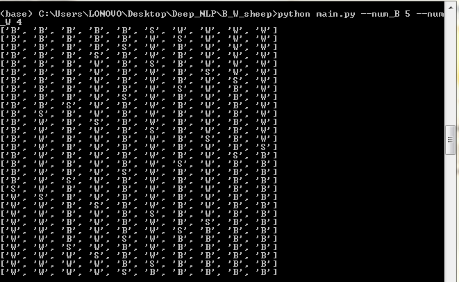

# B_W_sheep
In this project, we are attempting to solve the Black&White sheeps problem and we are not trying to reach an optimizing results.

<h1>Problem details :</h1>
<br>


<h1>Symbols in algorithm</h1>
number_B : The number of the Black sheeps <br>
number_W : The number of the white sheeps <br>
"B" : Black sheep <br>
"W" : White sheep <br>
index : the index of the space in the list <br>
save : save the color the sheep of the last step <br>
First_list : the first list of starting process <br>
final_list : the objective list
<h3>Functions :</h3>
moving_sheep : moving the sheep forward <br>
juming_step : jumping a sheep on another sheep <br>
checking_jump : check if a sheep can jump or not. <br>

<h3>Warning</h3>
Make sure to put both B_W_sheep.py and main.py in the same directory before usage.<br>

<h1>Usage:</h1>
<br>

```shell
$python main.py --num_B number_of_black_sheeps --num_W number_of_white_sheep
```

Example : 
In this example, we are assuming to select the number of black sheep is 5 and the number of white sheep is 4.<br>

```shell
$python main.py --num_B 5 --num_W 4
```

